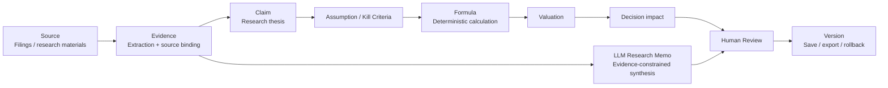

# Financial Research Decision Chain

**English** | [简体中文](README.zh-CN.md)

An auditable AI research-update prototype for fundamental equity research.

Instead of treating a new filing as a summarization task, the system asks:

- What changed?
- Which investment claims are affected?
- Which assumptions or kill criteria need review?
- What deterministic calculations change?
- What is the resulting decision impact?
- Can every important step be traced back to evidence and a versioned review?

Core chain:

`Source → Evidence → Claim → Assumption / Kill Criteria → Formula → Valuation → Decision → Human Review → Version`

> **Current scope:** Anker Innovations is the first end-to-end validation case. The architecture is designed for broader research workflows, but the current model input and automatic propagation remain limited to the Anker / C-04 path. Cross-company generalization has not yet been validated.

## Why this project exists

Financial research agents should not pretend to replace investor judgment. This project separates three responsibilities:

- **LLM:** research-language synthesis, candidate relationships, explanation and memo drafting under evidence constraints;
- **deterministic code:** financial calculations, unit/period handling, formula propagation, thresholds and reproducible comparisons;
- **human reviewer:** final claim validity, assumption ranges, professional judgment and investment decisions.

The design goal is not identical investment conclusions. It is a workflow in which machine-executable steps are auditable and important human decisions remain explicit.

## Architecture



| Layer | Responsibility |
| --- | --- |
| `apps/web/` | Next.js research workflow and UI |
| `lib/` | parser and deterministic decision-chain logic |
| `tests/` | parser, chain and regression tests |
| `docs/` | scope, freezes, model experiments, competition plan and audit history |
| `snapshots/` | migration/source integrity records |
| `blind-tests/` | preserved test-governance records |

For the precise capability boundary, see [`docs/SYSTEM_SCOPE.md`](docs/SYSTEM_SCOPE.md).

## What is implemented

- PDF-based research update workflow with source metadata and evidence lineage;
- Parser V0.6 regression-tested financial extraction;
- deterministic C-04 decision-chain propagation;
- evidence-aware LLM research memo generation;
- memo schema, citation/reference validation and blocking rules;
- human accept / return review state;
- version save, reload, export and rollback;
- preserved historical blind-test failures and regression records;
- Web interface under `apps/web/`.

## Quick start

Current CI baseline: Node.js 22.16.0 or a compatible Node 22 release.

```bash
cd apps/web
npm ci
cp .env.example .env.local
npm run dev
```

The development page is available at `http://localhost:3000`.

To run the deterministic test/build path:

```bash
cd apps/web
npm test
npm run build
npm run test:runtime
```

### Model configuration

The default model provider is DeepSeek. Configure credentials only in your local/server environment; never commit them.

```bash
MODEL_PROVIDER=deepseek
DEEPSEEK_API_KEY=your_server_side_key
DEEPSEEK_MODEL=deepseek-v4-pro
```

OpenAI remains an optional comparison provider through the variables documented in `apps/web/.env.example`.

## Validation status

As of 2026-09-10:

| Area | Status |
| --- | --- |
| Parser V0.6 | merged and regression-tested |
| Chain V0.1 | merged; deterministic propagation currently limited to C-04 and linked nodes |
| Web workflow | real S-05 / S-06 upload → review → save → reload / rollback path tested |
| LLM memo | real DeepSeek technical flow completed; output still requires human content review |
| Professional accounting review (EG-01) | pending |
| Professional valuation/investment review (EG-02) | pending |
| Cross-company generalization | not yet validated |
| Human memo revision/version lineage | proposed, not implemented |

**Technical workflow completion is not the same as financial accuracy, professional approval, long-term stability or cross-company generalization.**

The latest memo stage is documented in [`docs/MEMO_CONTENT_REVIEW_RUN_10.md`](docs/MEMO_CONTENT_REVIEW_RUN_10.md). Historical failures are intentionally preserved rather than rewritten after repairs.

### Blind-test note

S-07 was originally used as Blind Test 02 and exposed a parser failure. That first-run history is preserved. After the repair, S-07 became regression material and must **not** be represented as an unseen holdout. Future generalization claims require new, genuinely unseen material.

## Project governance

Core financial definitions are not changed simply to make tests pass:

- Claim
- Assumption
- Kill Criteria
- Formula
- Valuation
- Decision

Meaningful changes to those definitions require explicit review. Historical failures, model-output limitations and rollback records remain part of the project history.

See [`AGENTS.md`](AGENTS.md) and [`CONTRIBUTING.md`](CONTRIBUTING.md).

## Contributing

External technical review is welcome, particularly in:

1. **Architecture & agent workflow** — evidence lineage, orchestration, review boundaries and reproducibility;
2. **Parser & reliability** — extraction robustness, table/period handling and failure blockers;
3. **Cross-company generalization** — configuration boundaries and truly unseen validation materials.

Please read [`CONTRIBUTING.md`](CONTRIBUTING.md) before opening a pull request.

## Security and data

Do not commit API keys, `.env` files, licensed research, proprietary institutional data, personal information or confidential financial materials. See [`SECURITY.md`](SECURITY.md).

## Financial disclaimer

This repository is a research and engineering prototype, not investment, accounting, legal, brokerage or portfolio-management advice. Model outputs and calculations require independent verification before real-world use. See [`DISCLAIMER.md`](DISCLAIMER.md).

## License

Licensed under the [Apache License 2.0](LICENSE).

The license permits reuse and modification under its terms; it does **not** transfer authorship of this repository or allow removal of required attribution notices.

## Competition context

The project is being developed for the 2026 Beijing Undergraduate Financial Artificial Intelligence Competition under the theme of financial research agents. Competition delivery artifacts and product UI will continue to evolve separately from the frozen financial-business definitions above.

> Real product screenshots will be added after the UI is finalized. Until then, this README intentionally avoids mockups that could be mistaken for the running product.
