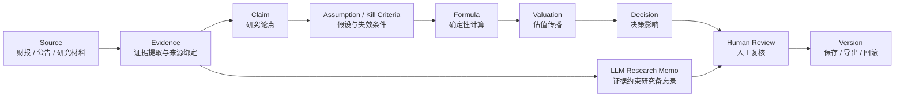

# Financial Research Decision Chain

[English](README.md) | **简体中文**

一个面向基本面研究的**可审计 AI 研究更新原型**。

它不是把“新财报”当作普通摘要任务，而是追踪：

- 新材料到底改变了什么；
- 哪些投资论点受到影响；
- 哪些假设或 Kill Criteria 需要重新检查；
- 哪些财务计算应由确定性代码更新；
- 变化最终如何影响估值与决策；
- 每一步是否都能回溯到证据、人工审核与版本记录。

核心链路：

`Source → Evidence → Claim → Assumption / Kill Criteria → Formula → Valuation → Decision → Human Review → Version`

> **当前边界：** 安克创新是第一个端到端验证案例。系统架构按更广泛的投研工作流设计，但当前模型输入和自动传播仍主要限定在安克 / C-04 路径。跨公司泛化尚未完成验收。

## 为什么做这个项目

金融投研 Agent 不应该假装“替代投资人”。本项目把职责拆成三层：

- **LLM：** 在证据约束下完成研究语言整理、候选关系判断、解释与备忘录草拟；
- **确定性代码：** 负责财务计算、单位与期间处理、公式传播、阈值和可复现比较；
- **人工审核：** 负责论点有效性、假设区间、专业判断与最终投资决策。

目标不是让不同投资人得出完全相同的结论，而是把适合机器执行的研究步骤做成可审计 workflow，同时让关键判断继续显式由人把关。

## 系统结构



### 代码层

| 目录 | 职责 |
| --- | --- |
| `apps/web/` | Next.js 研究工作流与 UI |
| `lib/` | Parser 与确定性决策链逻辑 |
| `tests/` | Parser、Chain 与回归测试 |
| `docs/` | 范围、冻结记录、模型实验、比赛计划与审计历史 |
| `snapshots/` | 迁移与源码完整性记录 |
| `blind-tests/` | 保留的测试治理记录 |

精确能力边界见 [`docs/SYSTEM_SCOPE.md`](docs/SYSTEM_SCOPE.md)。

## 当前已实现

- 基于 PDF 的研究更新流程；
- Source Metadata 与 Evidence lineage；
- Parser V0.6 财务提取与回归测试；
- C-04 确定性决策链传播；
- 带证据约束的 LLM Research Memo；
- Schema、引用校验与 blocker；
- 人工 Accept / Return 审核状态；
- 版本保存、重载、导出和回滚；
- 历史 blind-test 失败及修复回归记录；
- `apps/web/` 下的 Web 原型。

## 快速启动

当前 CI 基线为 Node.js 22.16.0，或兼容的 Node 22 版本。

```bash
cd apps/web
npm ci
cp .env.example .env.local
npm run dev
```

开发页面默认位于：

```text
http://localhost:3000
```

运行确定性测试 / 构建：

```bash
cd apps/web
npm test
npm run build
npm run test:runtime
```

### 模型配置

默认模型提供方为 DeepSeek。密钥仅应配置在本地或服务端环境中，**不要提交到 GitHub**。

```bash
MODEL_PROVIDER=deepseek
DEEPSEEK_API_KEY=your_server_side_key
DEEPSEEK_MODEL=deepseek-v4-pro
```

OpenAI 保留为可选对照提供方，环境变量见 `apps/web/.env.example`。

## 当前验收状态

截至 2026-09-10：

| 模块 | 状态 |
| --- | --- |
| Parser V0.6 | 已合并并完成回归测试 |
| Chain V0.1 | 已合并；确定性传播当前主要覆盖 C-04 及关联节点 |
| Web Workflow | S-05 / S-06 真实上传 → 审核 → 保存 → 重载 / 回滚流程已测试 |
| LLM Memo | DeepSeek 真实技术流程已跑通；文本内容仍需人工审核 |
| 专业会计复核 EG-01 | Pending |
| 专业估值 / 投资复核 EG-02 | Pending |
| 跨公司泛化 | 尚未验证 |
| 人工修改 Memo 与独立版本留痕 | 已提案，尚未实现 |

**技术流程通过，不等于金融内容准确、专业认可、长期稳定，也不等于跨公司泛化完成。**

最新 Memo 阶段见 [`docs/MEMO_CONTENT_REVIEW_RUN_10.md`](docs/MEMO_CONTENT_REVIEW_RUN_10.md)。历史失败记录有意保留，不会在修复后改写首次测试结果。

### 关于 S-07

S-07 最初作为 Blind Test 02 使用，并在首次运行中暴露 Parser 失败。首次失败记录永久保留。修复后，S-07 转为回归材料，因此**不能再被描述为 unseen holdout**。后续泛化验证必须使用新的、真正未见过的材料。

## 开发治理

我们不会为了让测试通过而随意修改这些核心金融定义：

- Claim
- Assumption
- Kill Criteria
- Formula
- Valuation
- Decision

涉及上述核心定义的实质修改必须单独评审。历史失败、模型局限与回滚记录都属于项目资产，不应被覆盖。

协作规则见 [`AGENTS.md`](AGENTS.md) 与 [`CONTRIBUTING.md`](CONTRIBUTING.md)。

## 外部技术评审

当前尤其欢迎以下三类 Review：

1. **Architecture & Agent Workflow** — Evidence lineage、LLM / deterministic / human 边界、可复现性；
2. **Parser & Reliability** — 表格 / 期间 / 列定位、失败阻断与过拟合风险；
3. **Cross-company Generalization** — 配置化边界与真正 unseen 的验证方案。

已有 Review Issue：

- [#18 Architecture & Agent Workflow](https://github.com/yivenwang/financial-research-decision-chain/issues/18)
- [#19 Parser Reliability & Failure Blocking](https://github.com/yivenwang/financial-research-decision-chain/issues/19)
- [#20 Cross-company Generalization](https://github.com/yivenwang/financial-research-decision-chain/issues/20)

提交 PR 前请先阅读 [`CONTRIBUTING.md`](CONTRIBUTING.md)。

## 安全与数据

不要提交 API Key、`.env`、付费或私有数据集、个人信息、机构内部研究或其他未经授权的金融材料。详见 [`SECURITY.md`](SECURITY.md)。

## 金融免责声明

本仓库是研究与工程原型，不构成投资、会计、法律、经纪或资产管理建议。模型输出和计算结果在真实使用前必须独立验证。详见 [`DISCLAIMER.md`](DISCLAIMER.md)。

## License

项目采用 [Apache License 2.0](LICENSE)。

该许可证允许在其条款下复用和修改代码，但并不转移本仓库的原创归属，也不允许删除许可证要求保留的归属与版权声明。

## 比赛背景

本项目正在参加 2026 北京市大学生金融人工智能大赛“金融投研智能体构建”方向。比赛交付物与产品 UI 会继续迭代，但不会因此随意改动已经冻结的金融业务定义。

---

> UI 定稿后，本 README 将补充真实产品截图与关键交互演示；在此之前不使用 mockup 冒充产品实机效果。
